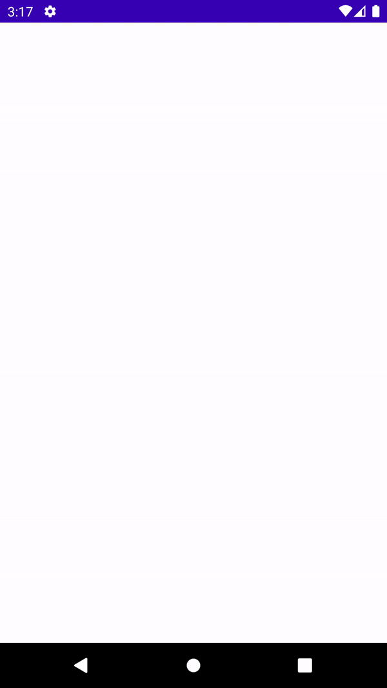
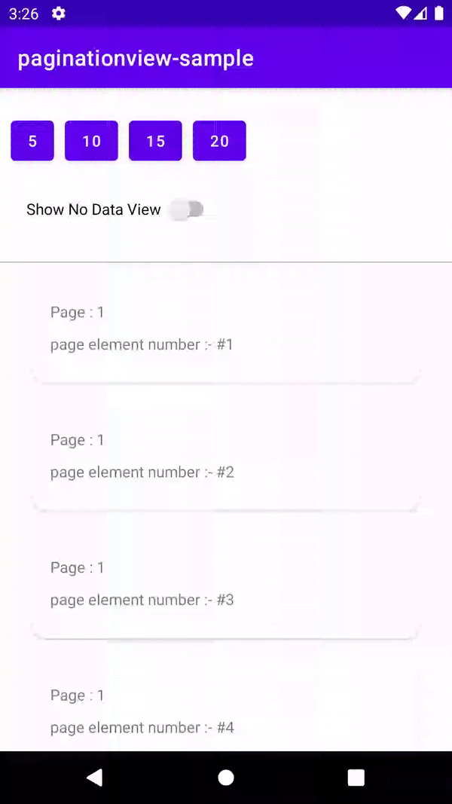
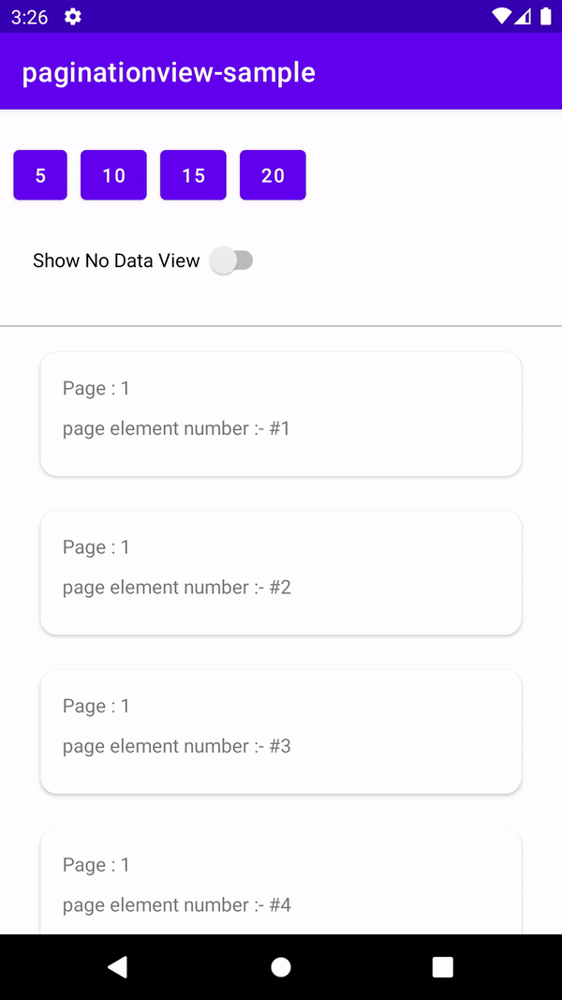

# Pagination View
Handy library to integrate pagination, which allow no data layout, refresh layout, recycler view in one view and easy way to bind pagination in app.

## Features
The Pagination View is combination of Refresh Layout, No Data Layout Container, And Recycler View which enable all funcnality in single view by using this view, You can do the following things:

1. Support for Refresh Callbacks
2. Support for No Data Layout
3. Support for RecyclerView

### We are using [Paginate Library](https://github.com/MarkoMilos/Paginate) which enables the following features.
- Pagination(infinite scrolling) by using PaginationBinder
- Custom loading view
- Custom Span Spacing for loading view
- Custom loading trigger threshold

# Demo - Pagination View

  <table>
    <tr>
      <h3>Pagination View & Custom Loading</h3>
      
    </tr>
    <tr>
      <h3>Pagination View & Refresh Layout</h3>
      
    </tr>
   <tr>
      <h3>Pagination View & No Data Layout</h3>
      
    </tr>
  </table>

  ## Usage

  ### Add to Project

  add the below to your app's build.gradle:

```groovy
    implementation 'com.dhiwise:paginationview:1.0.1'
```
### Step 1: Create PaginationView in XML

```xml
<com.dhiwise.pagination.PaginationView
            android:id="@+id/paginationView"
            android:layout_width="match_parent"
            android:layout_height="match_parent"
            app:image="@drawable/ic_no_data_found"
            app:listLayoutManager="linear"
            app:title="@string/msg_no_data_found"
            app:itemSpacing="12dp"
            />
```

### Attributes

| Attribute Name           | Default | Allowed Values                | Description                  |
|:-------------------------|:--------|:------------------------------|:-----------------------------|
| title                    | -       | string                        | no data layout title
| message                  | No data found... | string               | no data layout message
| titleTextColor           | BLACK   | color                         | no data layout title text color
| messageTextColor         | BLACK   | color                         | no data layout message text color
| titleTextSize            | -       | dimension                     | no data layout title text size
| messageTextSize          | -       | dimension                     | no data layout message text size
| noDataVewBg              | WHITE   | color                         | no data layout background color
| customNoDataVew          | empty_view_layout| xml reference layout | custom no data layout : Note that the custom layout must having views like imgNoData => ImageView and lblNoDataFound,lblMsgNoDataFound => TextView
| imageUrl                 | -       | string                        | internet url of no data found image
| image                    | -       | drawable                      | drawable image of no data layout
| listLayoutManager        | linear  | enum(linear,grid,staggered)   | recycler view layout manager
| spanCount                | 2       | integer                       | span count of grid or staggered layout manager
| itemSpacing              | -       | dimension                     | to provide spacing between list item |

### Step 2: Implement PageBindingCallback interface in your Fragment or Activity And override the interface methods

```kotlin
public class YourActivity : AppCompatActivity(),
    PageBindingCallback {

   private var paginationBinder: PaginationBinder? = null

    override fun onCreate(savedInstanceState: Bundle?) {
        super.onCreate(savedInstanceState)
        setContentView(R.layout.activity_layout)
    }

    override fun onLoadNext(
        newPageToLoad: Int,
        currentLoadedItemCnt: Int,
        pageElementCount: Int
    ) {
        //TODO handle load next page
    }

    override fun onNoDataFound() {
        //TODO handle on No data loaded
    }

    override fun onAllItemLoaded() {
        //TODO handle on data loaded
    }

    override fun getPaginationView(): PaginationView {
        return paginationView //the pagination view object
    }
}
```

### Step 3: Setup adapter and bind the PageBindingCallback

```kotlin
    paginationView.adapter = recyclerListViewAdapter

    paginationBinder =
         PaginationBinder.buildWith(pageElementCount, this)
                    .setOnRefresh {
                      //TODO handle the refresh callback
                    }
                    .build()

```

### How to manage the page loading or refresh layout loading ?
```kotlin
    //update the list and then call notify dataset change
    paginationView.adapter?.notifyDataSetChanged()

    //call onLoadFinish of paginationBinder and pass the latest list element size count
    paginationBinder?.onLoadFinish(updatedListSize)
```

### How do I manage no data layout ?
```kotlin
    //When onLoadNext function called and at that time if you get empty list size from api or your dataset then just pass the empty list size
    paginationBinder.onLoadFinish(listSize)

    //directly you want to show no data layout just pass zero
    paginationBinder.onLoadFinish(0)

    //you can do the same thing by using paginationView just call isNothingToLoad method with true as boolean argument.
    paginationView.isNothingToLoad(true)
```


## How do I implement custom no data layout ?
To modify no data layout you can implement the custom no data layout xml file in PaginationView, or you can also set the layout xml file in setNoDataLayoutRes method of PaginationOption which you can implement it when we are building the PaginationBinder object.

### using PaginationView
```kotlin
    paginationView.setNoDataLayoutRes(R.layout.your_no_data_layout)
```

### using PaginationOption
```kotlin
    paginationBinder = PaginationBinder.buildWith(pageElementCount, this)
         .setNoDataLayoutRes(R.layout.your_no_data_layout)
         .build()
```

## How do I implement custom loading view ?
To add custom loading view you can use setCustomLoadingItemHelper method of PaginationOption which you can implement it when we are building the PaginationBinder object.

```kotlin
    paginationBinder = PaginationBinder.buildWith(pageElementCount, this)
         .setCustomLoadingItemHelper(object :
                   CustomLoadingItemHelper(R.layout.your_loading_item) {
                   override fun onItemBind(layout: View) {
                       //manage your layout views here for showing custom message at loading time
                       //or anything you want
                   }
               })
         .build()
```
### How to manage span for loading view when recycler layout manager is type of staggered or grid ?
First of all don't manage span for full width of custom loading view it will automatically managed, but if you want to manage span for the special condition then implement the following.

```kotlin
    paginationBinder = PaginationBinder.buildWith(pageElementCount, this)
         .setOnLoadingItemSpanCountCallback {
                    val spanSize = 1 // your span size of LoadingView
                    spanSize
                }
         .build()
```